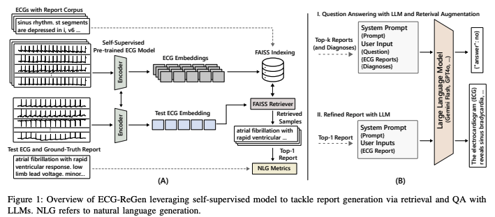

# 📑 ECG-LM

## Zero-Shot ECG Diagnosis with Large Language Models and Retrieval-Augmented Generation https://proceedings.mlr.press/v225/yu23b/yu23b.pdf

### Prompt Engineering
•**Diagnosis Guidance (DG):** Retrieved expert knowledge.

•**Feature Prompt (FeatP):** Extracted ECG features in a structured format.

•**Augmenting Information (AI):** Additional retrieved knowledge for context.

•**Format Prompt (FP):** Instructs LLMs to output structured JSON responses.

DG is retrieved from textbook and is included in every prompt

### Retrieval

VecDB: ChromaDB

Embedding: text-embedding-ada-002

Retriever: Nearest Neighbor Search

## ECG-Expert-QA: A Benchmark for Evaluating https://arxiv.org/pdf/2502.17475

### Data Processing

exclude highly similar records (cos>0.8)

only patients with ≥4 reports

### Tasks

Basic Cardiology: Covers fundamental medical knowledge of heart diseases, including cardiac anatomy and function, common types of heart diseases

Electrocardiogram (ECG) Expertise: Focuses on ECG analysis, including basic principles, waveform analysis, identification of common abnormalities 

Complex Disease Analysis: Generates detailed analysis reports for complex cases by simulating multi-turn dialogues between doctors and patients or medical professionals to formulate diagnostic and treatment plans.

## Electrocardiogram Report Generation and Question Answering via Retrieval-Augmented Self-Supervised Modeling https://arxiv.org/pdf/2409.08788

(1) self-supervised pre-training

(2) embedding generation and indexing

(3) report retrieval and refinement

(4) zero-shot LLM-based question-answering

### Pre-train

### Loss Function

•**Masked ECG Modeling (MEM)**: Predict missing ECG signal patches.

•**Masked Language Modeling (MLM)**: Predict missing words in reports.

•**ECG-Text Matching (ETM)**: Classifies whether an ECG and text pair are correctly matched.

### Structure

1. separate uni-modal encoders
2. a multi-modal fusion module 
3. separate uni-modal decoders for pre-training tasks

**FAISS for vector storage and retrieval** with **L2-normalized ECG embeddings**

